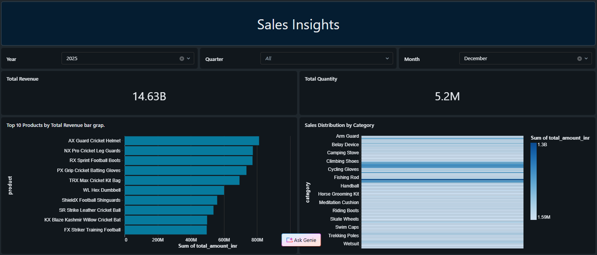

# 🏗️ Medallion Architecture Data Pipeline (FMCG Project) – Databricks Lakehouse

An end-to-end **production-style Data Engineering project** implementing the Medallion Architecture (Bronze → Silver → Gold) using **Databricks, PySpark, Delta Lake, and AWS S3**.

This project demonstrates scalable distributed processing, transactional data lakes, dimensional modeling, and BI-ready data delivery.

---

---

## 📚 Table of Contents

- [📌 Executive Summary](#-executive-summary)
- [🧠 Architecture Overview](#-architecture-overview)
  - [🔹 Bronze Layer (Raw Delta)](#-bronze-layer-raw-delta)
  - [🔹 Silver Layer (Cleaned Delta)](#-silver-layer-cleaned-delta)
  - [🔹 Gold Layer (Aggregated / BI Ready)](#-gold-layer-aggregated--bi-ready)
- [🛠️ Tech Stack](#-tech-stack)
- [📂 Repository Structure](#-repository-structure)
- [📊 Dashboard Output](#-dashboard-output)
- [🔄 Data Flow](#-data-flow)
- [⚡ Performance Optimization](#-performance-optimization)
- [🧪 Data Quality Checks](#-data-quality-checks)
- [🚀 How to Run](#-how-to-run)
- [📈 Scalability Considerations](#-scalability-considerations)
- [🔮 Future Improvements](#-future-improvements)
- [👨‍💻 Author](#-author)

---


## 📌 Executive Summary

This pipeline ingests raw FMCG transactional data from AWS S3 into Databricks, processes it through structured Bronze, Silver, and Gold layers using Delta Lake, and delivers analytics-ready data to a business intelligence dashboard.

Key capabilities demonstrated:

- ✅ Lakehouse architecture implementation
- ✅ Delta Lake ACID transactions
- ✅ Schema enforcement & evolution
- ✅ Data quality validation
- ✅ Dimensional modeling (Star Schema)
- ✅ Query optimization using Z-Ordering
- ✅ Dashboard integration via Databricks SQL

---

## 🧠 Architecture Overview


### 🔹 Bronze Layer (Raw Delta)
- Ingests raw CSV data from S3
- Stores as Delta tables
- Preserves historical data
- Adds metadata columns
- Supports CDC & reprocessing

### 🔹 Silver Layer (Cleaned Delta)
- Schema enforcement
- Deduplication
- Type casting
- Filtering invalid records
- Business logic transformations

### 🔹 Gold Layer (Aggregated / BI Ready)
- Fact & dimension tables
- Star schema modeling
- Aggregated KPIs
- Optimized for dashboard queries

---

## 🛠️ Tech Stack

| Component        | Technology Used |
|-----------------|----------------|
| Compute         | Databricks (Spark 3.x) |
| Language        | PySpark (Python 3.x) |
| Storage         | Delta Lake |
| Cloud           | AWS S3 |
| Orchestration   | Databricks Workflows |
| BI              | Databricks SQL Dashboard |
| CI/CD           | GitHub Actions |

---

## 📂 Repository Structure

```
databricks-medallion-lakehouse-fmcg/
│
├── notebooks/
│   ├── setup/
│   │   ├── setup_catalog.ipynb
│   │   └── utilities.ipynb
│   │
│   ├── silver/
│   │   ├── 1_customers_data_processing.ipynb
│   │   ├── 2_products_data_processing.ipynb
│   │   └── 3_pricing_data_processing.ipynb
│   │
│   ├── gold/
│   │   ├── dim_date_table_creation.ipynb
│   │   ├── 1_full_load_fact.ipynb
│   │   └── 2_incremental_load_fact.ipynb
│
├── docs/
│   ├── Architecture.png
│   └── Dashboard.png
│
├── README.md
└── requirements.txt

```

---

## 📊 Dashboard Output



### Key Business Metrics:
- Total Revenue: 14.63B
- Total Quantity: 5.2M
- Top 10 Products by Revenue
- Category-wise Sales Distribution

---

## 🔄 Data Flow

### 1️⃣ Bronze (Raw Ingestion)

```python
df = spark.read.format("csv") \
    .option("header", "true") \
    .load("s3://fmcg-landing-zone/transactions.csv")

df.write.format("delta") \
    .mode("append") \
    .save("/mnt/bronze/transactions")
```

---

### 2️⃣ Silver (Data Cleaning & Validation)

```python
silver_df = bronze_df.dropDuplicates(["transaction_id"])

silver_df = silver_df.withColumn(
    "quantity", col("quantity").cast("int")
)

silver_df.write.format("delta") \
    .mode("overwrite") \
    .save("/mnt/silver/transactions")
```

---

### 3️⃣ Gold (Business Modeling)

```python
fact_sales = silver_df.withColumn(
    "total_amount",
    col("quantity") * col("price")
)

fact_sales.write.format("delta") \
    .save("/mnt/gold/fact_sales")
```

---

## ⚡ Performance Optimization

### Partitioning
```python
.partitionBy("year")
```

### Z-Ordering
```sql
OPTIMIZE gold.fact_sales
ZORDER BY (product_id);
```

### Delta Time Travel
```sql
SELECT * FROM gold.fact_sales VERSION AS OF 2;
```

---

## 🧪 Data Quality Checks

- Schema validation
- Null checks
- Deduplication enforcement
- Cross-field validation
- Transaction integrity

Example:

```python
assert df.filter(col("transaction_id").isNull()).count() == 0
```

---

## 🚀 How to Run

1. Upload raw data to AWS S3
2. Create Databricks cluster
3. Configure S3 access
4. Run:
   - bronze.py
   - silver.py
   - gold.py
5. Open Databricks SQL → Create Dashboard

---

## 📈 Scalability Considerations

- Uses distributed Spark engine
- Minimizes shuffle via optimized joins
- Implements Delta compaction
- Supports large-scale datasets
- AQE (Adaptive Query Execution) compatible

---

## 🔮 Future Improvements

- Unity Catalog Integration
- Serverless Databricks
- Automated deployment via Terraform
- Streaming ingestion
- Great Expectations framework

---

## 👨‍💻 Author

Tanmay Kadlag  
Data Engineering | Lakehouse Architect | PySpark Enthusiast  

LinkedIn: https://www.linkedin.com/in/tanmay-kadlag25/

---

## ⭐ If you found this project useful, consider starring the repository.
